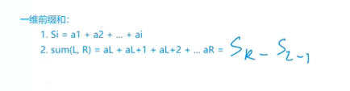

## 一维前缀和



步骤：

1. 预处理前缀和数组，一般为了防止数组越界（L - 1）使所有数组下标为0；
2. 用公式求区间和

[795. 前缀和 - AcWing题库](https://www.acwing.com/problem/content/797/)

```c++
#include <iostream>

using namespace std;

const int N = 100010;
int a[N] = {0};
int sum[N] = {0};
int n, m;
int l, r;

int main()
{
    scanf("%d %d", &n, &m);
    for (int i = 1; i <= n; i++) {
        cin >> a[i];
        sum[i] = sum[i - 1] + a[i];
    }
    
    while (m--) {
        scanf("%d %d", &l, &r);
        printf("%d\n", sum[r] - sum[l - 1]);
    }
    return 0;
}
```

## 二维前缀和

[796. 子矩阵的和 - AcWing题库](https://www.acwing.com/problem/content/798/)

```c++
#include <iostream>
#include <cstdio>

const int N = 1010;
int a[N][N];
int s[N][N];
int n, m;
int q;

int main()
{
    scanf("%d%d%d", &n, &m, &q);
    
    for (int i = 1; i <= n; i++) {
        for (int j = 1; j <= m; j++) {
            scanf("%d", &a[i][j]);
        }
    }
    
    for (int i = 1; i <= n; i++) {
        for (int j = 1; j <= m; j++) {
            s[i][j] = s[i - 1][j] + s[i][j - 1] - s[i - 1][j - 1] + a[i][j];
        }
    }
    
    int x1, y1;
    int x2, y2;
    int res;
    while (q--) {
        scanf("%d%d%d%d", &x1, &y1, &x2, &y2);
        res = s[x2][y2] - s[x1 - 1][y2] - s[x2][y1 - 1] + s[x1 - 1][y1 - 1];
        printf("%d\n", res);
    }
    return 0;
}
```

理清思路后其实不难

核心是```s[i][j]```和```res```的计算

```
s[i][j] = s[i - 1][j] + s[i][j - 1] - s[i - 1][j - 1] + a[i][j];
res = s[x2][y2] - s[x1 - 1][y2] - s[x2][y1 - 1] + s[x1 - 1][y1 - 1];
```

关于```s[i][j]```最开始的想法是和一维前缀和一样，在处理```a[i][j]```输入的时候顺便计算

```
s[i][j] = s[i][j - 1] + a[i][j]; 
```

但是这样明显有个问题，在 j - 1 恰好已经等于最后一列时，上面的式子将失去意义