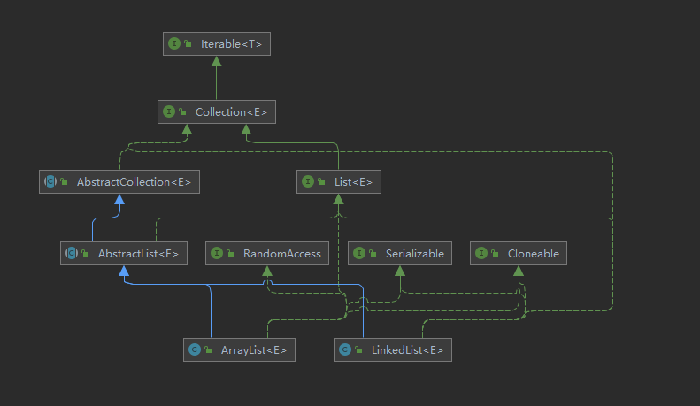

# 数据结构（Java描述）

## 线性表

Java描述一书中并没有详细讲解简单数组和简单链表，而是重点讲解如何实现自己的ArrayList<>和LinkedList<>类，这部分内容建议在有一定的Java基础（了解ArrayList和LinkedList如何使用，以及了解Javase中**泛型**及**内部类**）后，结合源码看书中的实现，会更事半功倍。

**重点：**

+ 掌握表的常规操作；
+ 熟悉四种表的使用场景；

+ 了解ArrayList和LinkedList的实现；


### 相关接口



#### Iterable与Iterator

Iterator的使用：

```java
ArrayList<Integer> arr = new ArrayList<Integer>();

        for(int i = 0; i < 100; i++){
            arr.add(i);
        }

        Iterator<Integer> iterator = arr.iterator();
        //结果：依次输出0~99
        while(iterator.hasNext()){
            System.out.println(iterator.next());
        }
```

所有的集合类都实现自Collection接口，而Collection接口又继承自Iterable接口

源码：

```java
public interface Iterable<T>{
    Iterator<T> iterator();
    ...
}

public interface Iterator<E> {
    boolean hasNext();
    
    E next();
    
    default void remove(){throw new UnsupportedOperationException("remove");}
    ...
}
```

1.8版本开始，这两个接口中都加了与for-each循环有关的方法

ArrayList中关于Iterator的实现,ArrayList并没有直接implements Iterator<E>接口，而是通过Itr这个私有内部类间接实现（**好处？Iterator模式？Iterator,for i , for each循环的不同？**）

```java
private class Itr implements Iterator<E> {
   		// index of next element to return    
   		int cursor; 
    	// index of last element returned; -1 if no such
        int lastRet = -1; 
        int expectedModCount = modCount;

        Itr() {}

        public boolean hasNext() {
            return cursor != size;
        }

        @SuppressWarnings("unchecked")
        public E next() {
            checkForComodification();
            int i = cursor;
            if (i >= size)
                throw new NoSuchElementException();
            Object[] elementData = ArrayList.this.elementData;
            if (i >= elementData.length)
                throw new ConcurrentModificationException();
            cursor = i + 1;
            return (E) elementData[lastRet = i];
        }

        public void remove() {
            if (lastRet < 0)
                throw new IllegalStateException();
            checkForComodification();

            try {
                ArrayList.this.remove(lastRet);
                cursor = lastRet;
                lastRet = -1;
                expectedModCount = modCount;
            } catch (IndexOutOfBoundsException ex) {
                throw new ConcurrentModificationException();
            }   
        }
    ...
}
        
```


#### Collection

一个接口，List<>,Set<>,Queue<>等接口都继承自它，Java中的大部分(全部？)数据结构都和它有关。

#### Serializable

[Java基础—Serializable的使用](https://www.cnblogs.com/huhx/p/serializable.html)

#### Cloneable

[Java提高篇—对象克隆](https://www.cnblogs.com/Qian123/p/5710533.html#_label2)

### ArrayList


### LinkedList


[ArrayList与LinkedList面试题]([Arraylist 与 LinkedList面试题 - 云+社区 - 腾讯云 (tencent.com)](https://cloud.tencent.com/developer/article/1698753))

### 栈

Deque


#### 应用

+ 检查成对符号(括号，引号等)
+ 中缀表达式转后缀表达式
+ 方法调用(递归的实现原理)


### 队列

#### 应用

+ 打印机任务队列
+ 计算机网络中用户访问文件服务器队列
+ 线程调度


[栈和队列面试题](https://www.cnblogs.com/qianguyihao/p/4795984.html)

## 排序

### 插入排序


### 希尔排序


### 冒泡排序


### 快速排序


### 简单选择排序


### 堆排序


### 归并排序


### 基数排序

# 参考

[数据结构与算法分析—Java语言描述](https://book.douban.com/subject/26745780/)

[Java - Iterable 接口、迭代器 Iterator](https://kucw.github.io/blog/2018/12/java-iterator/)

