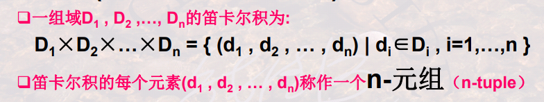
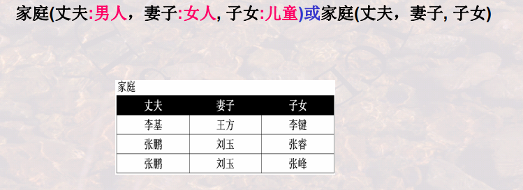
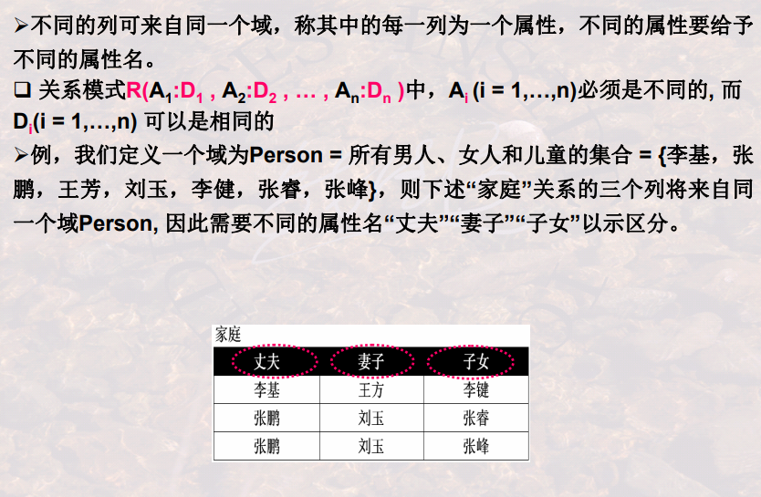
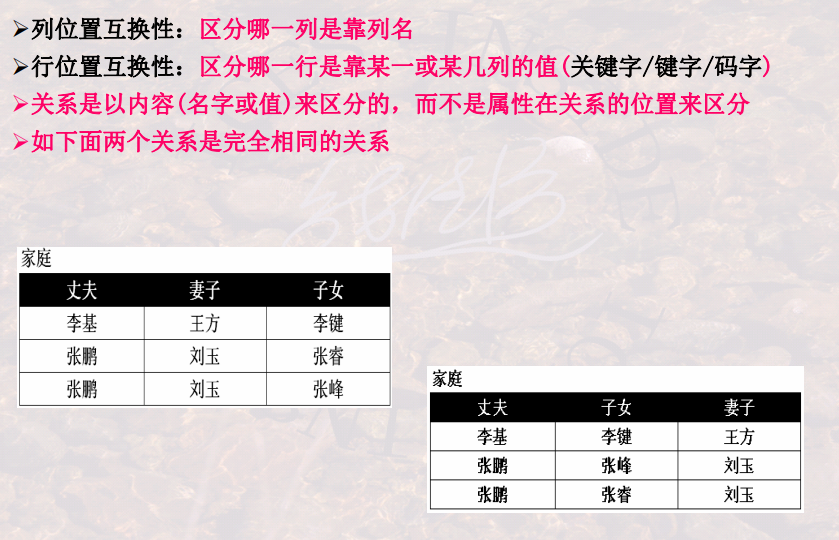
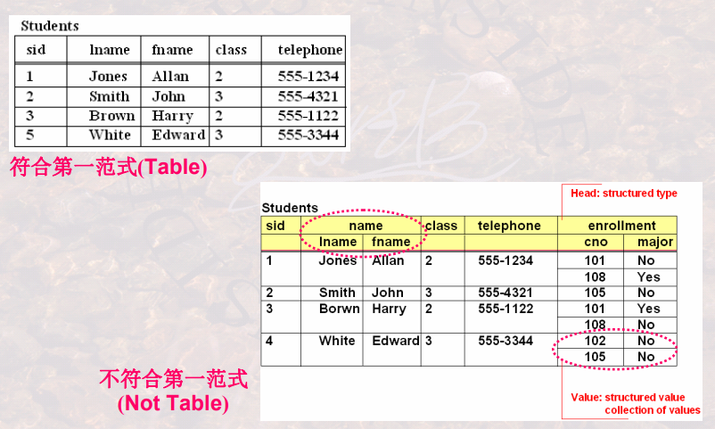

## 关系模型之基本概念

### 关系模型简述

+ 三个部分：

  + Table/Relation:描述DB各种数据的基本结构形式

    

  + 关系运算：描述Table与Table之间所可能发生的各种操作

    关系代数和关系演算（元组演算和域演算）

    基于关系代数设计的[数据库语言（ISBL）](https://en.wikipedia.org/wiki/ISBL)

    基于元组演算设计的数据库语言[（Ingress系统的QUEL）](https://en.wikipedia.org/wiki/QUEL_query_languages)

    | Relation Operator(base) |        |
    | :---------------------: | :----: |
    |          UNION          |   并   |
    |       DIFFERENCE        |   差   |
    |         PRODUCT         | 广义积 |
    |    <u>SELECT</u>ION     |  选择  |
    |    <u>PROJECT</u>ION    |  投影  |

    | Relation Operator(external) |      |
    | :-------------------------: | :--: |
    |     <u>INTERSECT</u>ION     |  交  |
    |            JOIN             | 连接 |
    |          DIVISION           | 运算 |

    

  + 完整性约束：描述这些操作所应遵循的约束条件

    实体完整性/参照完整性/用户自定义的完整性

    

### 关系的数学定义

+ 域（Domain）:一组值的集合，这组值具有相同的数据类型，集合中元素的个数称为域的基数（Cardinality）

+ 笛卡尔积（Cartesian Product）：

  

+ 分量（component）:元组（d1,d2,...,dn）的每一个值di叫做一个分量

+ 关系（Relation）:一组域D1,D2,...,Dn的笛卡尔积的子集，笛卡尔中具有某一方面意义的那些元组被称为一个关系

+ 属性名（列名）：由于关系的不同列可能来自同一个域，为区分，每一列的列名

+ 关系模式（Schema）/表标题（head）：关系可用R(A1:D1,A2:D2,...An:Dn)表示，可简记为R(A1,A2,...,An)

  R-关系的名字，Ai-属性，Di-属性所对应的域

  事例：

  

**关系模式与关系**

+ 同一关系模式下，可以有很多的关系
+ 关系模式是关系的结构，关系是关系模式在某一时刻的数据
+ 关系模式是稳定的；而关系是某一时刻的值，是随时间可能变化的

### 关系的特性及相关的概念

1. 列是同质：每一列中的分量来自同一域，是同一类型的数据
2. 
3. 

4. 属性不可再分特性（关系第一范式）：

   

**补充概念**

+ 候选码(Candidate Key)/候选键

### 关系模型中的完整性

