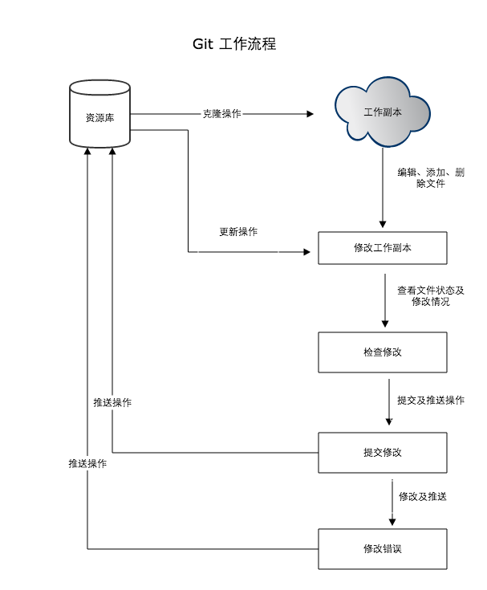

＃＃ Git工作流程



```
#显示当前的git配置信息
git config ---list

#编辑git配置文件，针对本仓库
git config -e

#编辑git配置文件，针对系统上所有仓库
git config -e --global

＃
git config --global user.name "xxx"
git config --global user.email xxx@xxx.com
#默认编辑器是nano
git config --global core.editor vim

git init
git init folder_name(newrepo)

# 将文件添加到缓存区
git add file_name

＃ 将缓存区内容添加到仓库中，并备注信息
git commit -m 'message..'

git clone repo_name
git clone repo_name directory

git status
git diff
git rm
git mv
git log
git pull
git push

git checkout branch_name
git branch

git tag

```