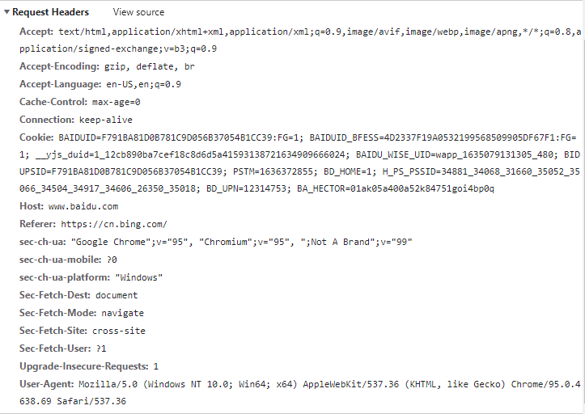
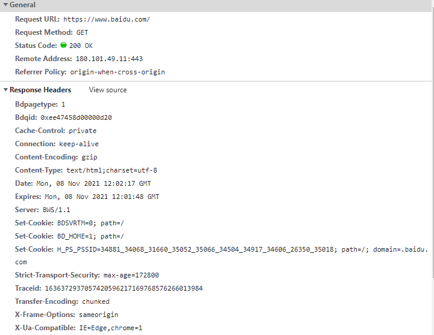
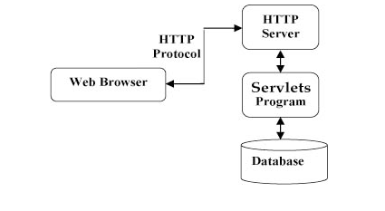
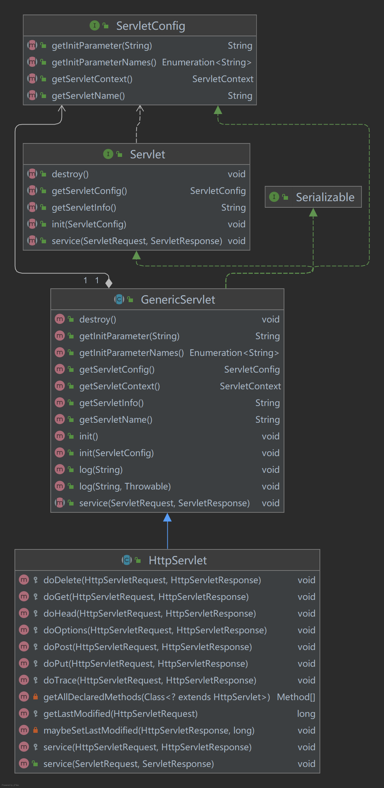
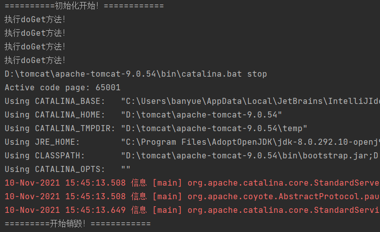
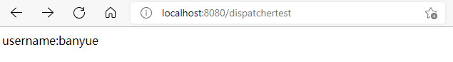
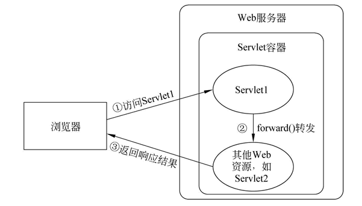

## 简介

**Javaweb:**  html+css+js	maven+mysql+JDBC+Tomcat

**Javaee:** 

+ 2015年之前：struts+hibernate+Spring
+ 2015~2018: SpringMVC+Spring+Mybatis
+ 2018~: SpringBoot+Spring+Mybatis
+ 微服务
+ 无服务
+ 服务网

### 动态网页与静态网页

| 动态网页                                                     | 静态网页                                                     |
| ------------------------------------------------------------ | ------------------------------------------------------------ |
| 可以根据不同的用户请求，时间或者环境的需求动态生成不同的网页内容，并且动态网页一般以数据库技术为基础，可以大大降低网站维护的工作量 | 内容一经发布到网站上，无论是否访问，始终保存在服务器上。信息量很大时，维护很困难 |
| 可实现更多的功能：登录/注册/查询等                           | 功能简单，交互性差                                           |
| 响应速度相对较慢                                             | 响应速度相对较快                                             |


## HTTP协议

### B/S架构和C/S架构


#### **Browser/Server架构**

+ 优点
  + 无需安装客户端，有web浏览器即可
  + 可以直接放在广域网上，通过一定的权限控制实现多客户访问的目的，交互性较强
  + 无需升级多个客户端，升级服务器即可
+ 缺点
  + 显示效果，响应速度不如C/S架构
  + 需要花费巨大的设计成本在速度和安全性上

#### **Client/Server架构**

+ 优点
  +  C/S架构的界面和操作可以很丰富。
  + 安全性能可以很容易保证，实现多层认证也不难。
  + 由于只有一层交互，因此响应速度较快。
+ 缺点
  + 适用面窄，通常用于局域网中。
  + 用户群固定。由于程序需要安装才可使用，因此不适合面向一些不可知的用户。
  + 维护成本高，发生一次升级，则所有客户端的程序都需要改变。


### http协议

+ HyperText Transfer Protocol 超文本传输协议，基于TCP/IP协议来传递数据，理论上可以基于任意一个可靠传输的协议

+ **<u>http请求流程</u>**

  1. DNS解析域名得到IP地址
  2. 客户端与服务器建立连接（TCP三次握手）
  3. 客户端发起请求
  4. 服务器接收到请求根据端口号：路径等找到对应的资源文件，响应源代码给客户端
  5. 客户端拿到请求到的数据，开始解析页面以及请求资源
  6. 客户端渲染页面
  7. web服务器断开连接（四次挥手）

  

#### URL（Uniform Resource Locator,统一资源定位符）

  俗称网址，是URI（Uniform Resource Identifier，统一资源标识符）的子集

  

#### http消息结构

+ 请求报文


在chrome中访问百度得到的请求头



+ 响应报文




#### http请求方法

http1.0 三种： GET/POST/HEAD

http1.1六种：PUT/PATCH/DELETE/OPTIONS/CONNECT/TRACE


| 方法    | 描述                                                         |
| ------- | ------------------------------------------------------------ |
| GET     | 请求指定的页面信息，并返回实体主体                           |
| POST    | 向指定资源提交数据进行处理请求（例如提交表单或者上传文件）。数据被包含在请求体中。POST 请求可能会导致新的资源的建立和/或已有资源的修改。 |
| HEAD    | 类似于 GET 请求，只不过返回的响应中没有具体的内容，用于获取报头 |
| PUT     | 从客户端向服务器传送的数据取代指定的文档的内容。             |
| PATCH   | 是对 PUT 方法的补充，用来对已知资源进行局部更新 。           |
| DELETE  | 请求服务器删除指定的页面。                                   |
| OPTIONS | 允许客户端查看服务器的性能。                                 |
| CONNECT | HTTP/1.1 协议中预留给能够将连接改为管道方式的代理服务器。    |
| TRACE   | 回显服务器收到的请求，主要用于测试或诊断。                   |


#### http响应头信息

https://www.runoob.com/http/http-header-fields.html

#### http状态码

+ 状态码分类：
  + 1xx:服务器收到请求，需要请求者继续执行操作
  + 2xx：成功，操作成功接收并处理
  + 3xx：重定向
  + 4xx：客户端错误，请求包含语法错误或无法完成请求
  + 5xx：服务器错误，服务器在处理请求的过程中发生了错误
+ 常见状态码：
  + 200：请求成功
  + 301：资源（网页等）被永久转移到其它URL
  + 404：请求的资源不存在
  + 500：内部服务器错误

  https://www.runoob.com/http/http-status-codes.html

## Servlet

### What is Servlet?

Service+applet

狭义的Servlet指的是Servlet接口，广义的一般指实现了Servlet接口的类

使用时通常通过extends HttpServlet来间接实现Servlet接口，在自定义类中override doGet()和doPost()方法







### 服务器

+ Javaweb中服务器的概念

Tomcat

+ Tomcat安装
+ Tomcat目录结构
+ Tomcat与idea
+ Tomcat与eclipse

### how to use Servlet?

Servlet3.0之前需要使用xml进行配置，比较麻烦：

```xml
	<servlet>
        <servlet-name>DemoServlet</servlet-name>
        <servlet-class>com.example.ideademo.DemoServlet</servlet-class>
    </servlet>

    <servlet-mapping>
        <servlet-name>DemoServlet</servlet-name>
        <url-pattern>/demo</url-pattern>
    </servlet-mapping>
```

Servlet3.0之后提供了注解配置的方式，使用@WebServlet就能实现同样的功能：

```java
@WebServlet(urlPatterns = "/demo")
public class DemoServlet extends HttpServlet {
    @Override
    protected void doGet(HttpServletRequest req, HttpServletResponse resp) throws ServletException, IOException {
        resp.setContentType("text/html;charset=utf-8");

        PrintWriter printWriter = resp.getWriter();
        printWriter.write("<div> hello, demoservlet!! </div>");
        System.out.println("执行doGet方法！");

    }
}
```


### Servlet生命周期

即Servlet对象从创建直到销毁的整个过程。

+ 调用init()方法初始化
+ 调用service()方法处理客户端的请求
+ 调用destroy()方法终止
+ 由JVM的垃圾回收器进行垃圾回收

#### init()方法

只调用一次，仅在第一次创建Servlet时被调用，后续每次用户请求时不再调用

当用户调用一个Servlet时，就会创建一个Servlet实例，每个用户请求都会产生一个新的线程

GenericServlet中的init()方法：

```java
public void init() throws ServletException {
    }
```


#### service()方法

执行实际任务时的方法

每次服务器接收到一个Servlet请求时，服务器会产生一个新的线程并调用服务，service方法检查Http请求类型，并在适当的时候调用doGet/doPost等方法。所以实际使用时只需要根据情况override doGet()/doPost()方法即可

```java
//HttpServlet中的service()方法
protected void service(HttpServletRequest req, HttpServletResponse resp) throws ServletException, IOException {
        String method = req.getMethod();
        long lastModified;
        if (method.equals("GET")) {
            lastModified = this.getLastModified(req);
            if (lastModified == -1L) {
                this.doGet(req, resp);
            } else {
                long ifModifiedSince = req.getDateHeader("If-Modified-Since");
                if (ifModifiedSince < lastModified) {
                    this.maybeSetLastModified(resp, lastModified);
                    this.doGet(req, resp);
                } else {
                    resp.setStatus(304);
                }
            }
        } else if (method.equals("HEAD")) {
            lastModified = this.getLastModified(req);
            this.maybeSetLastModified(resp, lastModified);
            this.doHead(req, resp);
        } else if (method.equals("POST")) {
            this.doPost(req, resp);
        } else if (method.equals("PUT")) {
            this.doPut(req, resp);
        } else if (method.equals("DELETE")) {
            this.doDelete(req, resp);
        } else if (method.equals("OPTIONS")) {
            this.doOptions(req, resp);
        } else if (method.equals("TRACE")) {
            this.doTrace(req, resp);
        } else {
            String errMsg = lStrings.getString("http.method_not_implemented");
            Object[] errArgs = new Object[]{method};
            errMsg = MessageFormat.format(errMsg, errArgs);
            resp.sendError(501, errMsg);
        }

    }
```

**在测试时可以使用postman工具实现不同种类请求**

#### destory()方法

只会被调用一次，在Servlet生命周期结束时被调用，在调用该方法后，servlet对象被标记为垃圾回收

```java
//GenericServlet类中的destory()方法
public void destroy() {
    }
```


#### 测试

sourcecode:

```java
public class DemoServlet extends HttpServlet {
    @Override
    public void init() throws ServletException {
        super.init();
        System.out.println("==========初始化开始！============");
    }

    @Override
    protected void doGet(HttpServletRequest req, HttpServletResponse resp) throws ServletException, IOException {
        resp.setContentType("text/html;charset=utf-8");

        PrintWriter printWriter = resp.getWriter();
        printWriter.write("<div> hello, demoservlet!! </div>");
        System.out.println("执行doGet方法！");

    }

    @Override
    public void destroy() {
        super.destroy();
        System.out.println("=========开始销毁！============");
    }
```

result:



### JavaWeb四大作用域对象

+ PageContext

  作用范围是整个JSP页面，当对JSP请求时开始，响应结束时销毁

+ ServletRequest

  作用范围是整个请求链，在service()方法调用前由服务器创建，传入service()方法，整个请求结束，request随之结束

+ HttpSession

  作用范围是一次会话。生命周期是在第一次调用request.getSession()方法时，服务器会检查是否已经有对应的session,如果没有就在内存中创建一个session并返回。当一段时间内session没有被使用（默认为30分钟），则服务器会销毁该session。如果服务器非正常关闭（强行关闭），没有到期的session也会跟着销毁。如果调用session提供的invalidate（） ，可以立即销毁session。

+ ServletContext

  作用范围是整个Web应用。当Web应用被加载进容器时创建代表整个web应用的ServletContext对象，当服务器关闭或Web应用被移除时，ServletContext对象跟着销毁。

### ServletContext

#### 概念

+ 代表了servlet环境的上下文，相当于一个全局存储空间
+ 同一个web应用程序中，所有的Servlet和JSP都可以共享同一个区域

#### 应用

##### 获取上下文初始化参数

可以在web.xml中设置全局的初始化参数,这些参数可以随时被任意一个Servlet访问


##### 实现Servlet之间的数据通讯

##### 读取Web应用下的资源文件

### HttpServletRequst

HttpServletRequest对象可调用以下方法：

| 序号 | 方法 & 描述                                                  |
| :--- | :----------------------------------------------------------- |
| 1    | **Cookie[] getCookies()** 返回一个数组，包含客户端发送该请求的所有的 Cookie 对象。 |
| 2    | **Enumeration getAttributeNames()** 返回一个枚举，包含提供给该请求可用的属性名称。 |
| 3    | **Enumeration getHeaderNames()** 返回一个枚举，包含在该请求中包含的所有的头名。 |
| 4    | **Enumeration getParameterNames()** 返回一个 String 对象的枚举，包含在该请求中包含的参数的名称。 |
| 5    | **HttpSession getSession()** 返回与该请求关联的当前 session 会话，或者如果请求没有 session 会话，则创建一个。 |
| 6    | **HttpSession getSession(boolean create)** 返回与该请求关联的当前 HttpSession，或者如果没有当前会话，且创建是真的，则返回一个新的 session 会话。 |
| 7    | **Locale getLocale()** 基于 Accept-Language 头，返回客户端接受内容的首选的区域设置。 |
| 8    | **Object getAttribute(String name)** 以对象形式返回已命名属性的值，如果没有给定名称的属性存在，则返回 null。 |
| 9    | **ServletInputStream getInputStream()** 使用 ServletInputStream，以二进制数据形式检索请求的主体。 |
| 10   | **String getAuthType()** 返回用于保护 Servlet 的身份验证方案的名称，例如，"BASIC" 或 "SSL"，如果JSP没有受到保护则返回 null。 |
| 11   | **String getCharacterEncoding()** 返回请求主体中使用的字符编码的名称。 |
| 12   | **String getContentType()** 返回请求主体的 MIME 类型，如果不知道类型则返回 null。 |
| 13   | **String getContextPath()** 返回指示请求上下文的请求 URI 部分。 |
| 14   | **String getHeader(String name)** 以字符串形式返回指定的请求头的值。 |
| 15   | **String getMethod()** 返回请求的 HTTP 方法的名称，例如，GET、POST 或 PUT。 |
| 16   | **String getParameter(String name)** 以字符串形式返回请求参数的值，或者如果参数不存在则返回 null。 |
| 17   | **String getPathInfo()** 当请求发出时，返回与客户端发送的 URL 相关的任何额外的路径信息。 |
| 18   | **String getProtocol()** 返回请求协议的名称和版本。          |
| 19   | **String getQueryString()** 返回包含在路径后的请求 URL 中的查询字符串。 |
| 20   | **String getRemoteAddr()** 返回发送请求的客户端的互联网协议（IP）地址。 |
| 21   | **String getRemoteHost()** 返回发送请求的客户端的完全限定名称。 |
| 22   | **String getRemoteUser()** 如果用户已通过身份验证，则返回发出请求的登录用户，或者如果用户未通过身份验证，则返回 null。 |
| 23   | **String getRequestURI()** 从协议名称直到 HTTP 请求的第一行的查询字符串中，返回该请求的 URL 的一部分。 |
| 24   | **String getRequestedSessionId()** 返回由客户端指定的 session 会话 ID。 |
| 25   | **String getServletPath()** 返回调用 JSP 的请求的 URL 的一部分。 |
| 26   | **String[] getParameterValues(String name)** 返回一个字符串对象的数组，包含所有给定的请求参数的值，如果参数不存在则返回 null。 |
| 27   | **boolean isSecure()** 返回一个布尔值，指示请求是否使用安全通道，如 HTTPS。 |
| 28   | **int getContentLength()** 以字节为单位返回请求主体的长度，并提供输入流，或者如果长度未知则返回 -1。 |
| 29   | **int getIntHeader(String name)** 返回指定的请求头的值为一个 int 值。 |
| 30   | **int getServerPort()** 返回接收到这个请求的端口号。         |

```java
//使用getHeaderNames() + getHeader()方法列举所有Http请求头信息
//hasMoreElements()判断循环
@WebServlet("/displayheader")
public class DisplayHeader extends HttpServlet {
    @Override
    protected void doGet(HttpServletRequest req, HttpServletResponse resp) throws ServletException, IOException {
        resp.setContentType("text/html");

        PrintWriter out = resp.getWriter();
        String title = "HTTP Header 实例";

        Enumeration headerNames = req.getHeaderNames();

        out.println(
                "<table>\n" +
                        "<tr>\n"+
                        "<th>Header name</th><th>Header value</th>\n" +
                        "</tr>\n"
        );
        while(headerNames.hasMoreElements()){
            String paramName = (String)headerNames.nextElement();
            out.println("<tr><td>" + paramName + "</td>");

            String paramValue = req.getHeader(paramName);
            out.println("<td>" + paramValue + "</td></tr>\n");
        }
        out.println("</table>\n</body>");
    }
}

```


### HttpSevletResponse

| 序号 | 方法 & 描述                                                  |
| :--- | :----------------------------------------------------------- |
| 1    | **String encodeRedirectURL(String url)** 为 sendRedirect 方法中使用的指定的 URL 进行编码，或者如果编码不是必需的，则返回 URL 未改变。 |
| 2    | **String encodeURL(String url)** 对包含 session 会话 ID 的指定 URL 进行编码，或者如果编码不是必需的，则返回 URL 未改变。 |
| 3    | **boolean containsHeader(String name)** 返回一个布尔值，指示是否已经设置已命名的响应报头。 |
| 4    | **boolean isCommitted()** 返回一个布尔值，指示响应是否已经提交。 |
| 5    | **void addCookie(Cookie cookie)** 把指定的 cookie 添加到响应。 |
| 6    | **void addDateHeader(String name, long date)** 添加一个带有给定的名称和日期值的响应报头。 |
| 7    | **void addHeader(String name, String value)** 添加一个带有给定的名称和值的响应报头。 |
| 8    | **void addIntHeader(String name, int value)** 添加一个带有给定的名称和整数值的响应报头。 |
| 9    | **void flushBuffer()** 强制任何在缓冲区中的内容被写入到客户端。 |
| 10   | **void reset()** 清除缓冲区中存在的任何数据，包括状态码和头。 |
| 11   | **void resetBuffer()** 清除响应中基础缓冲区的内容，不清除状态码和头。 |
| 12   | **void sendError(int sc)** 使用指定的状态码发送错误响应到客户端，并清除缓冲区。 |
| 13   | **void sendError(int sc, String msg)** 使用指定的状态发送错误响应到客户端。 |
| 14   | **void sendRedirect(String location)** 使用指定的重定向位置 URL 发送临时重定向响应到客户端。 |
| 15   | **void setBufferSize(int size)** 为响应主体设置首选的缓冲区大小。 |
| 16   | **void setCharacterEncoding(String charset)** 设置被发送到客户端的响应的字符编码（MIME 字符集）例如，UTF-8。 |
| 17   | **void setContentLength(int len)** 设置在 HTTP Servlet 响应中的内容主体的长度，该方法设置 HTTP Content-Length 头。 |
| 18   | **void setContentType(String type)** 如果响应还未被提交，设置被发送到客户端的响应的内容类型。 |
| 19   | **void setDateHeader(String name, long date)** 设置一个带有给定的名称和日期值的响应报头。 |
| 20   | **void setHeader(String name, String value)** 设置一个带有给定的名称和值的响应报头。 |
| 21   | **void setIntHeader(String name, int value)** 设置一个带有给定的名称和整数值的响应报头。 |
| 22   | **void setLocale(Locale loc)** 如果响应还未被提交，设置响应的区域。 |
| 23   | **void setStatus(int sc)** 为该响应设置状态码。              |

### RequestDispatcher（请求转发）

```java
request.getRequestDispatcher(URL地址).forward(request,reponse)
```

**在浏览器地址栏中不会显示转发后的地址，属于服务器内部转发，整个过程处于同一个请求当中**


```java
@WebServlet("/dispatchertest")
public class DispatcherTest extends HttpServlet {
    @Override
    protected void doGet(HttpServletRequest req, HttpServletResponse resp) throws ServletException, IOException {
        resp.setContentType("text/html;charset=utf-8");

        req.setAttribute("username","banyue");

        RequestDispatcher dispatcher = req.getRequestDispatcher("/dispatchertest02");
        dispatcher.forward(req,resp);
    }
}
```


```java
@WebServlet("/dispatchertest02")
public class DispatcherTest2 extends HttpServlet {
    @Override
    protected void doGet(HttpServletRequest req, HttpServletResponse resp) throws ServletException, IOException {
        resp.setContentType("text/html;charset=utf-8");
        PrintWriter out = resp.getWriter();
        String username = (String) req.getAttribute("username");
        if(username != null){
            out.println("username:" + username + "<br/>");
        }
    }

```



在DispatcherTest中使用getRequestDispatcher()方法转发到“/dispatchertest02”，也就是DispatcherTest2所在的页面。



https://www.cnblogs.com/phpzxh/archive/2010/02/01/1661137.html

### EL表达式

Expression Language

### sendRedirect（请求重定向）

## 附录

#### idea快捷键：[cnblog](https://www.cnblogs.com/hkgov/p/12209317.html#:~:text=IntelliJ%20IDEA%20%E5%BF%AB%E6%8D%B7%E9%94%AE%201%20Editing%20%28%E7%BC%96%E8%BE%91%29%202%20Search%2FReplace,...%209%20Live%20Templates%20%28%E5%8A%A8%E6%80%81%E6%A8%A1%E6%9D%BF%29%2010%20General%20%28%E4%BB%A3%E7%A0%81%E7%94%9F%E6%88%90%29)
