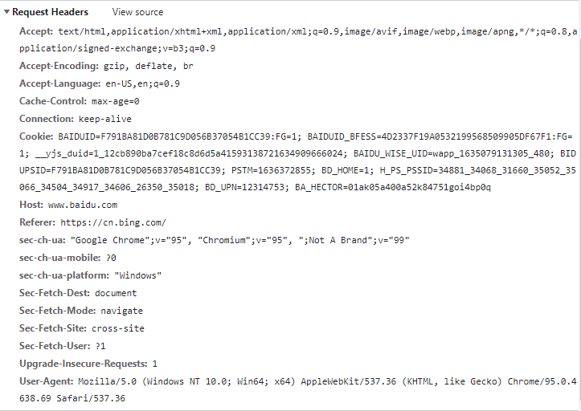
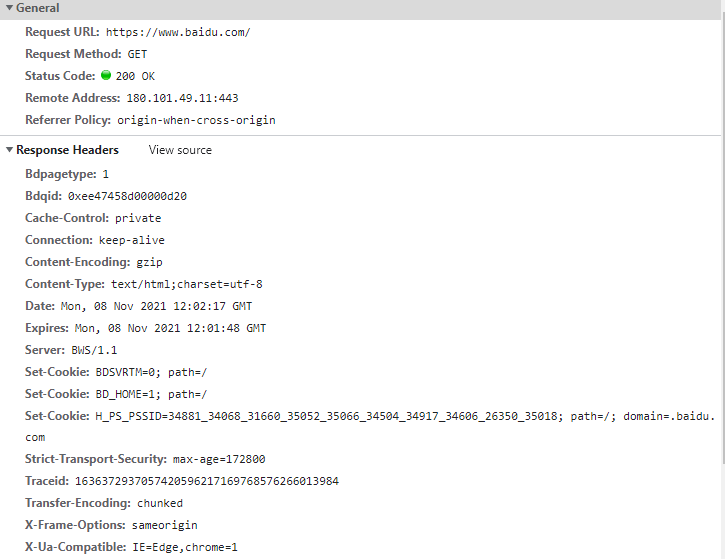
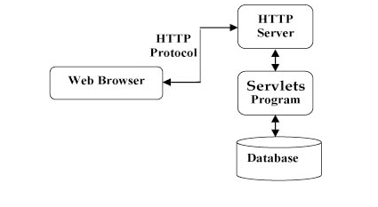
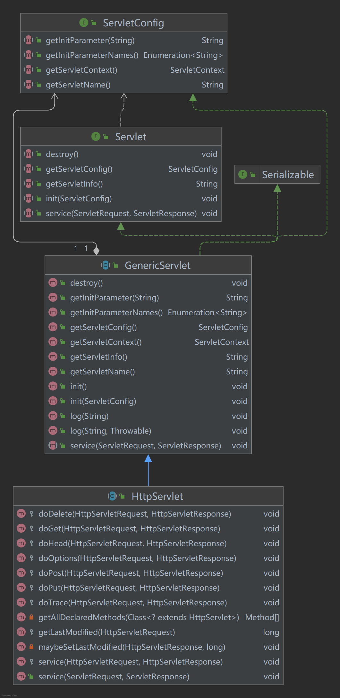
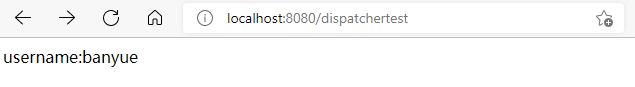
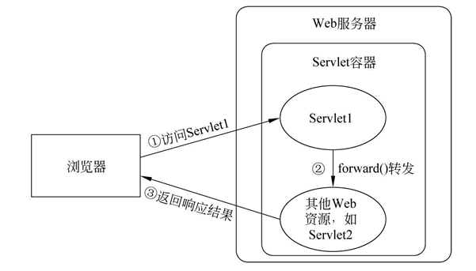

## 简介

**Javaweb:**  html+css+js	maven+mysql+JDBC+Tomcat

**Javaee:** 

+ 2015年之前：struts+hibernate+Spring
+ 2015~2018: SpringMVC+Spring+Mybatis
+ 2018~: SpringBoot+Spring+Mybatis
+ 微服务
+ 无服务
+ 服务网

### 动态网页与静态网页

| 动态网页                                                     | 静态网页                                                     |
| ------------------------------------------------------------ | ------------------------------------------------------------ |
| 可以根据不同的用户请求，时间或者环境的需求动态生成不同的网页内容，并且动态网页一般以数据库技术为基础，可以大大降低网站维护的工作量 | 内容一经发布到网站上，无论是否访问，始终保存在服务器上。信息量很大时，维护很困难 |
| 可实现更多的功能：登录/注册/查询等                           | 功能简单，交互性差                                           |
| 响应速度相对较慢                                             | 响应速度相对较快                                             |


## HTTP协议

### B/S架构和C/S架构


#### **Browser/Server架构**

+ 优点
  + 无需安装客户端，有web浏览器即可
  + 可以直接放在广域网上，通过一定的权限控制实现多客户访问的目的，交互性较强
  + 无需升级多个客户端，升级服务器即可
+ 缺点
  + 显示效果，响应速度不如C/S架构
  + 需要花费巨大的设计成本在速度和安全性上

#### **Client/Server架构**

+ 优点
  +  C/S架构的界面和操作可以很丰富。
  + 安全性能可以很容易保证，实现多层认证也不难。
  + 由于只有一层交互，因此响应速度较快。
+ 缺点
  + 适用面窄，通常用于局域网中。
  + 用户群固定。由于程序需要安装才可使用，因此不适合面向一些不可知的用户。
  + 维护成本高，发生一次升级，则所有客户端的程序都需要改变。


### http协议

+ HyperText Transfer Protocol 超文本传输协议，基于TCP/IP协议来传递数据，理论上可以基于任意一个可靠传输的协议

+ **<u>http请求流程</u>**

  1. DNS解析域名得到IP地址
  2. 客户端与服务器建立连接（TCP三次握手）
  3. 客户端发起请求
  4. 服务器接收到请求根据端口号：路径等找到对应的资源文件，响应源代码给客户端
  5. 客户端拿到请求到的数据，开始解析页面以及请求资源
  6. 客户端渲染页面
  7. web服务器断开连接（四次挥手）

  

#### URL（Uniform Resource Locator,统一资源定位符）

  俗称网址，是URI（Uniform Resource Identifier，统一资源标识符）的子集

  

#### http消息结构

+ 请求报文


在chrome中访问百度得到的请求头



+ 响应报文




#### http请求方法

http1.0 三种： GET/POST/HEAD

http1.1六种：PUT/PATCH/DELETE/OPTIONS/CONNECT/TRACE


| 方法    | 描述                                                         |
| ------- | ------------------------------------------------------------ |
| GET     | 请求指定的页面信息，并返回实体主体                           |
| POST    | 向指定资源提交数据进行处理请求（例如提交表单或者上传文件）。数据被包含在请求体中。POST 请求可能会导致新的资源的建立和/或已有资源的修改。 |
| HEAD    | 类似于 GET 请求，只不过返回的响应中没有具体的内容，用于获取报头 |
| PUT     | 从客户端向服务器传送的数据取代指定的文档的内容。             |
| PATCH   | 是对 PUT 方法的补充，用来对已知资源进行局部更新 。           |
| DELETE  | 请求服务器删除指定的页面。                                   |
| OPTIONS | 允许客户端查看服务器的性能。                                 |
| CONNECT | HTTP/1.1 协议中预留给能够将连接改为管道方式的代理服务器。    |
| TRACE   | 回显服务器收到的请求，主要用于测试或诊断。                   |


#### http响应头信息

https://www.runoob.com/http/http-header-fields.html

#### http状态码

+ 状态码分类：
  + 1xx:服务器收到请求，需要请求者继续执行操作
  + 2xx：成功，操作成功接收并处理
  + 3xx：重定向
  + 4xx：客户端错误，请求包含语法错误或无法完成请求
  + 5xx：服务器错误，服务器在处理请求的过程中发生了错误
+ 常见状态码：
  + 200：请求成功
  + 301：资源（网页等）被永久转移到其它URL
  + 404：请求的资源不存在
  + 500：内部服务器错误

  https://www.runoob.com/http/http-status-codes.html

## Servlet

### What is Servlet?

Service+applet

狭义的Servlet指的是Servlet接口，广义的一般指实现了Servlet接口的类

使用时通常通过extends HttpServlet来间接实现Servlet接口，在自定义类中override doGet()和doPost()方法







### 服务器

+ Javaweb中服务器的概念

Tomcat

+ Tomcat安装
+ Tomcat目录结构
+ Tomcat与idea
+ Tomcat与eclipse

### how to use Servlet?

Servlet3.0之前需要使用xml进行配置，比较麻烦：

```xml
	<servlet>
        <servlet-name>DemoServlet</servlet-name>
        <servlet-class>com.example.ideademo.DemoServlet</servlet-class>
    </servlet>

    <servlet-mapping>
        <servlet-name>DemoServlet</servlet-name>
        <url-pattern>/demo</url-pattern>
    </servlet-mapping>
```

Servlet3.0之后提供了注解配置的方式，使用@WebServlet就能实现同样的功能：

```java
@WebServlet(urlPatterns = "/demo")
public class DemoServlet extends HttpServlet {
    @Override
    protected void doGet(HttpServletRequest req, HttpServletResponse resp) throws ServletException, IOException {
        resp.setContentType("text/html;charset=utf-8");

        PrintWriter printWriter = resp.getWriter();
        printWriter.write("<div> hello, demoservlet!! </div>");
        System.out.println("执行doGet方法！");

    }
}
```


### Servlet生命周期

即Servlet对象从创建直到销毁的整个过程。

+ 调用init()方法初始化
+ 调用service()方法处理客户端的请求
+ 调用destroy()方法终止
+ 由JVM的垃圾回收器进行垃圾回收

#### init()方法

只调用一次，仅在第一次创建Servlet时被调用，后续每次用户请求时不再调用

当用户调用一个Servlet时，就会创建一个Servlet实例，每个用户请求都会产生一个新的线程

GenericServlet中的init()方法：

```java
public void init() throws ServletException {
    }
```


#### service()方法

执行实际任务时的方法

每次服务器接收到一个Servlet请求时，服务器会产生一个新的线程并调用服务，service方法检查Http请求类型，并在适当的时候调用doGet/doPost等方法。所以实际使用时只需要根据情况override doGet()/doPost()方法即可

```java
//HttpServlet中的service()方法
protected void service(HttpServletRequest req, HttpServletResponse resp) throws ServletException, IOException {
        String method = req.getMethod();
        long lastModified;
        if (method.equals("GET")) {
            lastModified = this.getLastModified(req);
            if (lastModified == -1L) {
                this.doGet(req, resp);
            } else {
                long ifModifiedSince = req.getDateHeader("If-Modified-Since");
                if (ifModifiedSince < lastModified) {
                    this.maybeSetLastModified(resp, lastModified);
                    this.doGet(req, resp);
                } else {
                    resp.setStatus(304);
                }
            }
        } else if (method.equals("HEAD")) {
            lastModified = this.getLastModified(req);
            this.maybeSetLastModified(resp, lastModified);
            this.doHead(req, resp);
        } else if (method.equals("POST")) {
            this.doPost(req, resp);
        } else if (method.equals("PUT")) {
            this.doPut(req, resp);
        } else if (method.equals("DELETE")) {
            this.doDelete(req, resp);
        } else if (method.equals("OPTIONS")) {
            this.doOptions(req, resp);
        } else if (method.equals("TRACE")) {
            this.doTrace(req, resp);
        } else {
            String errMsg = lStrings.getString("http.method_not_implemented");
            Object[] errArgs = new Object[]{method};
            errMsg = MessageFormat.format(errMsg, errArgs);
            resp.sendError(501, errMsg);
        }

    }
```

**在测试时可以使用postman工具实现不同种类请求**

#### destory()方法

只会被调用一次，在Servlet生命周期结束时被调用，在调用该方法后，servlet对象被标记为垃圾回收

```java
//GenericServlet类中的destory()方法
public void destroy() {
    }
```


#### 测试

sourcecode:

```java
public class DemoServlet extends HttpServlet {
    @Override
    public void init() throws ServletException {
        super.init();
        System.out.println("==========初始化开始！============");
    }

    @Override
    protected void doGet(HttpServletRequest req, HttpServletResponse resp) throws ServletException, IOException {
        resp.setContentType("text/html;charset=utf-8");

        PrintWriter printWriter = resp.getWriter();
        printWriter.write("<div> hello, demoservlet!! </div>");
        System.out.println("执行doGet方法！");

    }

    @Override
    public void destroy() {
        super.destroy();
        System.out.println("=========开始销毁！============");
    }
```

result:


### JavaWeb四大作用域对象

+ PageContext

  作用范围是整个JSP页面，当对JSP请求时开始，响应结束时销毁

+ ServletRequest

  作用范围是整个请求链，在service()方法调用前由服务器创建，传入service()方法，整个请求结束，request随之结束

+ HttpSession

  作用范围是一次会话。生命周期是在第一次调用request.getSession()方法时，服务器会检查是否已经有对应的session,如果没有就在内存中创建一个session并返回。当一段时间内session没有被使用（默认为30分钟），则服务器会销毁该session。如果服务器非正常关闭（强行关闭），没有到期的session也会跟着销毁。如果调用session提供的invalidate（） ，可以立即销毁session。

+ ServletContext

  作用范围是整个Web应用。当Web应用被加载进容器时创建代表整个web应用的ServletContext对象，当服务器关闭或Web应用被移除时，ServletContext对象跟着销毁。

### ServletContext

#### 概念

+ 代表了servlet环境的上下文，相当于一个全局存储空间
+ 同一个web应用程序中，所有的Servlet和JSP都可以共享同一个区域

#### 应用

##### 获取上下文初始化参数

可以在web.xml中设置全局的初始化参数,这些参数可以随时被任意一个Servlet访问


##### 实现Servlet之间的数据通讯

##### 读取Web应用下的资源文件

### HttpServletRequst

HttpServletRequest对象可调用以下方法：

| 序号 | 方法 & 描述                                                  |
| :--- | :----------------------------------------------------------- |
| 1    | **Cookie[] getCookies()** 返回一个数组，包含客户端发送该请求的所有的 Cookie 对象。 |
| 2    | **Enumeration getAttributeNames()** 返回一个枚举，包含提供给该请求可用的属性名称。 |
| 3    | **Enumeration getHeaderNames()** 返回一个枚举，包含在该请求中包含的所有的头名。 |
| 4    | **Enumeration getParameterNames()** 返回一个 String 对象的枚举，包含在该请求中包含的参数的名称。 |
| 5    | **HttpSession getSession()** 返回与该请求关联的当前 session 会话，或者如果请求没有 session 会话，则创建一个。 |
| 6    | **HttpSession getSession(boolean create)** 返回与该请求关联的当前 HttpSession，或者如果没有当前会话，且创建是真的，则返回一个新的 session 会话。 |
| 7    | **Locale getLocale()** 基于 Accept-Language 头，返回客户端接受内容的首选的区域设置。 |
| 8    | **Object getAttribute(String name)** 以对象形式返回已命名属性的值，如果没有给定名称的属性存在，则返回 null。 |
| 9    | **ServletInputStream getInputStream()** 使用 ServletInputStream，以二进制数据形式检索请求的主体。 |
| 10   | **String getAuthType()** 返回用于保护 Servlet 的身份验证方案的名称，例如，"BASIC" 或 "SSL"，如果JSP没有受到保护则返回 null。 |
| 11   | **String getCharacterEncoding()** 返回请求主体中使用的字符编码的名称。 |
| 12   | **String getContentType()** 返回请求主体的 MIME 类型，如果不知道类型则返回 null。 |
| 13   | **String getContextPath()** 返回指示请求上下文的请求 URI 部分。 |
| 14   | **String getHeader(String name)** 以字符串形式返回指定的请求头的值。 |
| 15   | **String getMethod()** 返回请求的 HTTP 方法的名称，例如，GET、POST 或 PUT。 |
| 16   | **String getParameter(String name)** 以字符串形式返回请求参数的值，或者如果参数不存在则返回 null。 |
| 17   | **String getPathInfo()** 当请求发出时，返回与客户端发送的 URL 相关的任何额外的路径信息。 |
| 18   | **String getProtocol()** 返回请求协议的名称和版本。          |
| 19   | **String getQueryString()** 返回包含在路径后的请求 URL 中的查询字符串。 |
| 20   | **String getRemoteAddr()** 返回发送请求的客户端的互联网协议（IP）地址。 |
| 21   | **String getRemoteHost()** 返回发送请求的客户端的完全限定名称。 |
| 22   | **String getRemoteUser()** 如果用户已通过身份验证，则返回发出请求的登录用户，或者如果用户未通过身份验证，则返回 null。 |
| 23   | **String getRequestURI()** 从协议名称直到 HTTP 请求的第一行的查询字符串中，返回该请求的 URL 的一部分。 |
| 24   | **String getRequestedSessionId()** 返回由客户端指定的 session 会话 ID。 |
| 25   | **String getServletPath()** 返回调用 JSP 的请求的 URL 的一部分。 |
| 26   | **String[] getParameterValues(String name)** 返回一个字符串对象的数组，包含所有给定的请求参数的值，如果参数不存在则返回 null。 |
| 27   | **boolean isSecure()** 返回一个布尔值，指示请求是否使用安全通道，如 HTTPS。 |
| 28   | **int getContentLength()** 以字节为单位返回请求主体的长度，并提供输入流，或者如果长度未知则返回 -1。 |
| 29   | **int getIntHeader(String name)** 返回指定的请求头的值为一个 int 值。 |
| 30   | **int getServerPort()** 返回接收到这个请求的端口号。         |

```java
//使用getHeaderNames() + getHeader()方法列举所有Http请求头信息
//hasMoreElements()判断循环
@WebServlet("/displayheader")
public class DisplayHeader extends HttpServlet {
    @Override
    protected void doGet(HttpServletRequest req, HttpServletResponse resp) throws ServletException, IOException {
        resp.setContentType("text/html");

        PrintWriter out = resp.getWriter();
        String title = "HTTP Header 实例";

        Enumeration headerNames = req.getHeaderNames();

        out.println(
                "<table>\n" +
                        "<tr>\n"+
                        "<th>Header name</th><th>Header value</th>\n" +
                        "</tr>\n"
        );
        while(headerNames.hasMoreElements()){
            String paramName = (String)headerNames.nextElement();
            out.println("<tr><td>" + paramName + "</td>");

            String paramValue = req.getHeader(paramName);
            out.println("<td>" + paramValue + "</td></tr>\n");
        }
        out.println("</table>\n</body>");
    }
}

```


### HttpSevletResponse

| 序号 | 方法 & 描述                                                  |
| :--- | :----------------------------------------------------------- |
| 1    | **String encodeRedirectURL(String url)** 为 sendRedirect 方法中使用的指定的 URL 进行编码，或者如果编码不是必需的，则返回 URL 未改变。 |
| 2    | **String encodeURL(String url)** 对包含 session 会话 ID 的指定 URL 进行编码，或者如果编码不是必需的，则返回 URL 未改变。 |
| 3    | **boolean containsHeader(String name)** 返回一个布尔值，指示是否已经设置已命名的响应报头。 |
| 4    | **boolean isCommitted()** 返回一个布尔值，指示响应是否已经提交。 |
| 5    | **void addCookie(Cookie cookie)** 把指定的 cookie 添加到响应。 |
| 6    | **void addDateHeader(String name, long date)** 添加一个带有给定的名称和日期值的响应报头。 |
| 7    | **void addHeader(String name, String value)** 添加一个带有给定的名称和值的响应报头。 |
| 8    | **void addIntHeader(String name, int value)** 添加一个带有给定的名称和整数值的响应报头。 |
| 9    | **void flushBuffer()** 强制任何在缓冲区中的内容被写入到客户端。 |
| 10   | **void reset()** 清除缓冲区中存在的任何数据，包括状态码和头。 |
| 11   | **void resetBuffer()** 清除响应中基础缓冲区的内容，不清除状态码和头。 |
| 12   | **void sendError(int sc)** 使用指定的状态码发送错误响应到客户端，并清除缓冲区。 |
| 13   | **void sendError(int sc, String msg)** 使用指定的状态发送错误响应到客户端。 |
| 14   | **void sendRedirect(String location)** 使用指定的重定向位置 URL 发送临时重定向响应到客户端。 |
| 15   | **void setBufferSize(int size)** 为响应主体设置首选的缓冲区大小。 |
| 16   | **void setCharacterEncoding(String charset)** 设置被发送到客户端的响应的字符编码（MIME 字符集）例如，UTF-8。 |
| 17   | **void setContentLength(int len)** 设置在 HTTP Servlet 响应中的内容主体的长度，该方法设置 HTTP Content-Length 头。 |
| 18   | **void setContentType(String type)** 如果响应还未被提交，设置被发送到客户端的响应的内容类型。 |
| 19   | **void setDateHeader(String name, long date)** 设置一个带有给定的名称和日期值的响应报头。 |
| 20   | **void setHeader(String name, String value)** 设置一个带有给定的名称和值的响应报头。 |
| 21   | **void setIntHeader(String name, int value)** 设置一个带有给定的名称和整数值的响应报头。 |
| 22   | **void setLocale(Locale loc)** 如果响应还未被提交，设置响应的区域。 |
| 23   | **void setStatus(int sc)** 为该响应设置状态码。              |

### RequestDispatcher（请求转发）

```java
request.getRequestDispatcher(URL地址).forward(request,reponse)
```

**在浏览器地址栏中不会显示转发后的地址，属于服务器内部转发，整个过程处于同一个请求当中**


```java
@WebServlet("/dispatchertest")
public class DispatcherTest extends HttpServlet {
    @Override
    protected void doGet(HttpServletRequest req, HttpServletResponse resp) throws ServletException, IOException {
        resp.setContentType("text/html;charset=utf-8");

        req.setAttribute("username","banyue");

        RequestDispatcher dispatcher = req.getRequestDispatcher("/dispatchertest02");
        dispatcher.forward(req,resp);
    }
}
```


```java
@WebServlet("/dispatchertest02")
public class DispatcherTest2 extends HttpServlet {
    @Override
    protected void doGet(HttpServletRequest req, HttpServletResponse resp) throws ServletException, IOException {
        resp.setContentType("text/html;charset=utf-8");
        PrintWriter out = resp.getWriter();
        String username = (String) req.getAttribute("username");
        if(username != null){
            out.println("username:" + username + "<br/>");
        }
    }

```



在DispatcherTest中使用getRequestDispatcher()方法转发到“/dispatchertest02”，也就是DispatcherTest2所在的页面。



https://www.cnblogs.com/phpzxh/archive/2010/02/01/1661137.html

### EL表达式

Expression Language

### sendRedirect（请求重定向）

https://www.cnblogs.com/duanwandao/p/9855229.html

### Cookies

概念：Http是一种无状态的协议，Cookie是服务器改善到用户浏览器并保存在本地的一小块数据，会在浏览器下次向同一服务器再发起请求时被携带并发送到服务器上。

应用：

+ 会话状态管理（如用户登录状态/购物车/游戏分数或其它需要记录的信息）
+ 个性化设置（如用户自定义设置/主题等）
+ 浏览器行为跟踪（如跟踪分析用户行为等）

构造器：

```java
Cookie(String name, String value)
	Construct a cookie with a specified name and value
```

常用方法：

Cookie没有setName()和setValue()方法

| 序号 | 方法 & 描述                                                  |
| :--- | :----------------------------------------------------------- |
| 1    | **public void setDomain(String pattern)** 该方法设置 cookie 适用的域，例如 w3cschool.cn。 |
| 2    | **public String getDomain()** 该方法获取 cookie 适用的域，例如 w3cschool.cn。 |
| 3    | **public void setMaxAge(int expiry)** 该方法设置 cookie 过期的时间（以秒为单位）。如果不这样设置，cookie 只会在当前 session 会话中持续有效。 |
| 4    | **public int getMaxAge()** 该方法返回 cookie 的最大生存周期（以秒为单位），默认情况下，-1 表示 cookie 将持续下去，直到浏览器关闭。 |
| 5    | **public String getName()** 该方法返回 cookie 的名称。名称在创建后不能改变。 |
| 6    | **public void setValue(String newValue)** 该方法设置与 cookie 关联的值。 |
| 7    | **public String getValue()** 该方法获取与 cookie 关联的值。  |
| 8    | **public void setPath(String uri)** 该方法设置 cookie 适用的路径。如果您不指定路径，与当前页面相同目录下的（包括子目录下的）所有 URL 都会返回 cookie。 |
| 9    | **public String getPath()** 该方法获取 cookie 适用的路径。   |
| 10   | **public void setSecure(boolean flag)** 该方法设置布尔值，表示 cookie 是否应该只在加密的（即 SSL）连接上发送。 |
| 11   | **public void setComment(String purpose)** 该方法规定了描述 cookie 目的的注释。该注释在浏览器向用户呈现 cookie 时非常有用。 |
| 12   | **public String getComment()** 该方法返回了描述 cookie 目的的注释，如果 cookie 没有注释则返回 null。 |

[Document of javax.servlet.http.Cookie](https://tomcat.apache.org/tomcat-5.5-doc/servletapi/#:~:text=%EE%80%80Servlet%20API%EE%80%81%20Documentation.%20The%20javax.%EE%80%80servlet%EE%80%81%20package%20contains%20a,such%20a%20class%20by%20a%20conforming%20%EE%80%80servlet%EE%80%81%20container.)


```java
 //为firstname和lastname创建cookies
        Cookie firstName = new Cookie("first_name",req.getParameter("first_name"));
        Cookie lastName = new Cookie("last_name", req.getParameter("last_name"));

        // 为cookies设置最大保存时间
        firstName.setMaxAge(60*60*24);
        lastName.setMaxAge(60*60*24);

        //在响应头添加两个cookies
        resp.addCookie(firstName);
        resp.addCookie(lastName);


// 获取cookie的方法
		Cookie[] cookies = null;

        cookies = req.getCookies();

        resp.setContentType("text/html; charset=utf-8");

        PrintWriter out = resp.getWriter();

        if(cookies != null){
            out.println("<h2>cookies名称和值</h2>");
            for (int i = 0; i < cookies.length; i++) {
                out.println("name: " + cookies[i].getName() +
                        ", " + "value: " + cookies[i].getValue() +
                        "<br/>"
                );
            }
        }
        else{
            out.println(
                    "<h2> not found!</h2>"
            );
        }

```


### Session

Http是一种“无状态”协议，这意味着每次客户端检索网页时，客户端打开一个单独的连接到Web服务器，服务器不会保留之前客户端请求的任何记录

HttpSession方法：

| 序号 | 方法 & 描述                                                  |
| :--- | :----------------------------------------------------------- |
| 1    | **public Object getAttribute(String name)** 该方法返回在该 session 会话中具有指定名称的对象，如果没有指定名称的对象，则返回 null。 |
| 2    | **public Enumeration getAttributeNames()** 该方法返回 String 对象的枚举，String 对象包含所有绑定到该 session 会话的对象的名称。 |
| 3    | **public long getCreationTime()** 该方法返回该 session 会话被创建的时间，自格林尼治标准时间 1970 年 1 月 1 日午夜算起，以毫秒为单位。 |
| 4    | **public String getId()** 该方法返回一个包含分配给该 session 会话的唯一标识符的字符串。 |
| 5    | **public long getLastAccessedTime()** 该方法返回客户端最后一次发送与该 session 会话相关的请求的时间自格林尼治标准时间 1970 年 1 月 1 日午夜算起，以毫秒为单位。 |
| 6    | **public int getMaxInactiveInterval()** 该方法返回 Servlet 容器在客户端访问时保持 session 会话打开的最大时间间隔，以秒为单位。 |
| 7    | **public void invalidate()** 该方法指示该 session 会话无效，并解除绑定到它上面的任何对象。 |
| 8    | **public boolean isNew(** 如果客户端还不知道该 session 会话，或者如果客户选择不参入该 session 会话，则该方法返回 true。 |
| 9    | **public void removeAttribute(String name)** 该方法将从该 session 会话移除指定名称的对象。 |
| 10   | **public void setAttribute(String name, Object value)** 该方法使用指定的名称绑定一个对象到该 session 会话。 |
| 11   | **public void setMaxInactiveInterval(int interval)** 该方法在 Servlet 容器指示该 session 会话无效之前，指定客户端请求之间的时间，以秒为单位。 |

在HttpServletRequest类中，有关session创建的两个方法：

```java
getSession():Returns the current session associated with this request, or if the request does not have a session, creates one.

getSession(boolean create):Returns the current HttpSession associated with this request or, if there is no current session and create is true, returns a new session.

```

Session跟踪实例：

```java
@WebServlet("/sessiontest")
public class SessionTest extends HttpServlet {
    @Override
    protected void doGet(HttpServletRequest req, HttpServletResponse resp) throws ServletException, IOException {
        HttpSession session = req.getSession();

        Date creatTime = new Date(session.getCreationTime());

        Date lastAccessTime = new Date(session.getLastAccessedTime());

        String first = "欢迎来到米奇妙妙屋！";
        String second = "欢迎回来！";

        int visitCount = 0;

        resp.setContentType("text/html; charset=utf-8");
        PrintWriter out = resp.getWriter();
        if(session.isNew()){
            out.println(
                    "<h2>" + first + "</h2>" +
                            "<br/>" + "访问次数：" +
                            visitCount +
                            "<br/>" + "创建时间：" +
                            creatTime +
                            "<br/>" + "最后访问时间： " +
                            lastAccessTime
            );
        }
       else{
            ++visitCount;
            out.println(
                    "<h2>" + second + "</h2>" +
                            "<br/>" + "访问次数：" +
                            visitCount +
                            "<br/>" + "创建时间：" +
                            creatTime +
                            "<br/>" + "最后访问时间： " +
                            lastAccessTime
            );

        }
        }
    }
```

### Filter(过滤器)

+ 作用

  + 动态地拦截请求和响应，变换或使用包含在请求或响应中的信息
  + 在客户端的请求访问后端资源之前，拦截这些请求
  + 在服务端的响应发送回客户端之前，处理这些请求

+ 生命周期

  + init: 在容器初始化的时候调用一次
  + doFilter:只要命中过滤规则就触发
  + destory:容器销毁的时候调用一次

  ```java
  public interface Filter {
      default void init(FilterConfig filterConfig) throws ServletException {
      }
  
      void doFilter(ServletRequest var1, ServletResponse var2, FilterChain var3) throws IOException, ServletException;
  
      default void destroy() {
      }
  }
  
  ```

+ FilterChain类

  ```java
  void doFilter(ServletRequest request, ServletResponse response)
  //Causes the next filter in the chain to be invoked, or if the calling filter is the last filter in the chain, causes the resource at the end of the chain to be invoked
  //简单点来说调用此方法时可以跳过当前过滤
  ```

+ @WebFilter

  ```
  //该Filter是否支持异步操作模式
  asyncSupported      
  //指定Filter对那种dispatcher模式进行过滤 该属性支持 Async,Error Forward,include,request  
  dispatcherType  
  //Filter 显示的名称
  displayName    
  ​
  //Filter的名称
  filterName    
  ​
  //Filter的配置参数
  initParams    
  ​
  //过滤的Servlet可以指定多个,表示对这几个特定的的servlet 进行过滤
  servletNames    
  ​
  //指定 Filter拦截的 URL，和上面的servletNames配置一样，用*可以表示通配符，但是不用字母后加*，应该按照模块划分，比如/user/*
  urlPatterns/value    
  ```

#### Filter配置参数

+ FilterConfig类

  | **Method Summary**       |                                                              |
  | ------------------------ | ------------------------------------------------------------ |
  | ` java.lang.String`      | **getFilterName()**    Returns the filter-name of this filter as defined in the deployment descriptor. |
  | ` java.lang.String`      | **[getInitParameter](https://tomcat.apache.org/tomcat-5.5-doc/servletapi/javax/servlet/FilterConfig.html#getInitParameter(java.lang.String))**(java.lang.String name)      Returns a `String` containing the value of the named initialization parameter, or `null` if the parameter does not exist. |
  | ` java.util.Enumeration` | **[getInitParameterNames](https://tomcat.apache.org/tomcat-5.5-doc/servletapi/javax/servlet/FilterConfig.html#getInitParameterNames())**()    Returns the names of the filter's initialization parameters as an `Enumeration` of `String` objects, or an empty `Enumeration` if the filter has no initialization parameters. |
  | ` ServletContext`        | **[getServletContext](https://tomcat.apache.org/tomcat-5.5-doc/servletapi/javax/servlet/FilterConfig.html#getServletContext())**()      Returns a reference to the [`ServletContext`](https://tomcat.apache.org/tomcat-5.5-doc/servletapi/javax/servlet/ServletContext.html) in which the caller is executing. |


+ dispatcherTypes 参数
  + 指定Filter对那种dispatcher模式进行过滤，不符合的则不进行过滤
  + REQUEST：默认值，浏览器直接请求的资源会被过滤器拦截
  + FORWARD：转发访问资源会被过滤器拦截
  + INCLUDE：包含访问资源
  + ERROR：错误跳转资源
  + ASYNC：异步访问资源

#### 用户登录访问个人页面拦截（实例）

+ LoginController
+ UserController
+ LogoutController
+ LoginFilterController
+ login.jsp
+ user.jsp


逻辑：

1. 新用户直接访问user.jsp会被拦截
2. 登录错误会要求重新登录，登录成功会显示个人信息
3. 登录成功后关闭页面，可直接访问user.jsp无需再次登录
4. 注销后，重新访问user.jsp会跳转到login.jsp


### Listener(监听器)

可以理解为一个实现了Listener接口的的类，当被监听对象发生某些改变时，会执行相应的操作,（设计模式中的Listener模式？）

+ Servlet中与Listener有关的类：
  + HttpSessionListener
  + HttpSessionBindingListener
  + HttpSessionAttributeListener
  + ServletContextListener
  + ServletContextAttributeListener
  + ServletRequestLisener
  + ServletRequestAttributeListener

#### ServletContextListener

实现的方法(参考[servlet4.0文档](https://javaee.github.io/javaee-spec/javadocs/javax/servlet/ServletContextListener.html))：

+ 在web.xml中声明
+ 添加WebListener注解
+ 在ServletContext通过addListener方法register(注册？)

method:

+ contextDestroyed(ServletContextEvent sce):Receives notification that the ServletContext is about to be shut down.


+ contextInitialized(ServletContextEvent sce): Receives notification that the web application initialization process is starting.

  所有的ServletContextListener在context一初始化时就会收到信息，并且会在filters和servlet初始化之前

#### ServletContextAttributeListener

method:

+ attributedAdded(ServletContextAttributeEvent envent)
+ attributedRemoved(ServletContextAttributeEvent envent)
+ attributedReplaced(ServletContextAttributeEvent envent)

#### HttpSessionListener


#### ServletRequestListener


### 文件上传下载

MultipartConfig

+ 前端：
  + 必须是post方法

## 附录

#### idea快捷键：[cnblog](https://www.cnblogs.com/hkgov/p/12209317.html#:~:text=IntelliJ%20IDEA%20%E5%BF%AB%E6%8D%B7%E9%94%AE%201%20Editing%20%28%E7%BC%96%E8%BE%91%29%202%20Search%2FReplace,...%209%20Live%20Templates%20%28%E5%8A%A8%E6%80%81%E6%A8%A1%E6%9D%BF%29%2010%20General%20%28%E4%BB%A3%E7%A0%81%E7%94%9F%E6%88%90%29)
