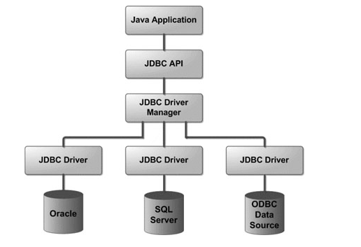

# JDBC

Java DataBase Connection,是一种标准Java应用程序接口(API)，用来连接Java语言和数据库


## JDBC架构



JDBC在Java 应用和数据库驱动之间起到解耦的作用

JDBC的接口和类实际上分别在java.sql和javax.sql中，(下面的都属于java.sql)常见组件有：

+ class DriverManager
+ interface Driver
+ interface Connection
+ interface Statement
+ interface ResultSet
+ SQLException

## JDBC连接数据库

四个步骤：

+ 导入JDBC包

示例：

```java
try{
            Class.forName("com.mysql.cj.jdbc.Driver");
        }
        catch(ClassNotFoundException e){
            System.out.println("Error:unable to load driver class!");
            // code: 0 表示正常退出程序； code: 1或-1或 任何其它非零值 表示非正常退出
            System.exit(1);
        }
```

+ 注册JDBC驱动程序


+ 数据库URL制定


+ 创建连接对象

  

<u>如何正确关闭数据库？</u>

## 数据库连接池


## JDBC数据类型


## JDBC Statement

Statement类型

PreparedStatement类型

CallableStatement类型


## JDBC事务


[JDBC常见面试题](https://zhuanlan.zhihu.com/p/33528569#:~:text=JDBC%E9%9D%A2%E8%AF%95%E9%A2%98%201%20Class.forName%20%28%29%E6%96%B9%E6%B3%95%E6%9C%89%E4%BB%80%E4%B9%88%E4%BD%9C%E7%94%A8%EF%BC%9F%202%20PreparedStatement%E6%AF%94Statement%E6%9C%89%20...%203,DBC%E7%9A%84DriverManager%E6%98%AF%E7%94%A8%E6%9D%A5%E5%81%9A%E4%BB%80%E4%B9%88%E7%9A%84%EF%BC%9F%209%20JDBC%E7%9A%84Statement%E6%98%AF%E4%BB%80%E4%B9%88%EF%BC%9F%2010%20execute%EF%BC%8CexecuteQuery%EF%BC%8Cexecut%20...%20%E6%9B%B4%E5%A4%9A%E7%BB%93%E6%9E%9C...%20)

## 参考

1. [w3cschool](https://www.w3cschool.cn/jdbc/84pl1my8.html)

