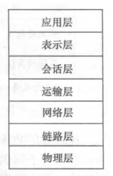
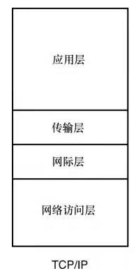
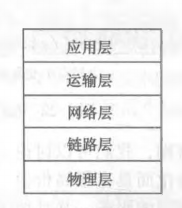
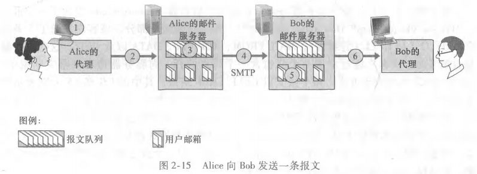
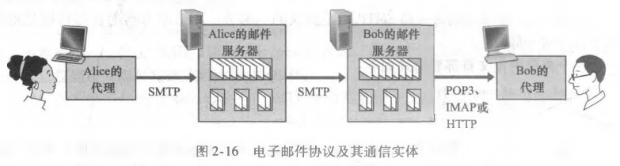

## 分层体系

1. 理论上的模型

ISO/OSI参考模型

2. 实际的模型

TCP/IP四层模型

3. 5层网络协议

## 应用层

主要针对两大应用：浏览器和邮箱

### Web和HTTP协议
   
HTTP协议：定义了Web客户向Web服务器请求Web页面的方式，以及服务器向客户传送Web页面的方式。

基于TCP协议以完成可靠传输，而不是UDP协议

**重点:** HTTP协议是无状态协议，也就是说服务器只向客户发送被请求的文件，而不存储任何关于该客户的状态信息。即无论你多少次发起请求，在浏览器看来这都是你的第一次请求。而平常在浏览网页时遇到的记录登录状态的功能则是借助cookie和session实现的。

### SMTP协议

SMTP的基本过程：

**关键词：** 邮件服务器，报文队列，TCP连接

1. Alice调用邮件代理程序并提供Bob的邮件地址，撰写报文，指示用户代理发送报文；
2. Alice的用户代理将报文发送到她的邮件服务器，并存放在报文队列中；
3. 运行在Alice的邮件服务器上的SMTP客户端发现了在报文队列中的报文，创建一个指向BOb的邮件服务器上的SMTP服务器的TCP连接；
4. 经过TCP握手，SMTP客户通过TCP发送报文；
5. Bob的SMTP服务器接收报文，放入其邮箱中；
6. Bob方便的时候，调用用户代理阅读该报文。

与HTTP的异同点：

+ 相同：都是基于TCP连接实现，都是C/S模式
+ 不同：SMTP并不是实时连接；SMTP协议是一种类似于push，HTTP协议类似于pull

代理程序和邮件服务器之间并不总是采用SMTP连接，也有可能采用POP3、IMAP和HTTP协议

#### 邮箱中的HTTP协议

接触到最多的一种方式，使用浏览器收发邮件时（浏览器到邮件服务器），采用的就是此种协议。

#### POP3（Post Office Protocol - Version 3）协议

三个阶段：

特许（authorization, 翻译成“认证”更好？）：用户代理发送用户名和口令以鉴别用户；

事务处理：用户代理取回报文；（还可以做删除标记，取消删除标记，以及获取邮件的统计信息）

更新：在客户发出quit命令后执行，结束会话并且删除被标记为删除的报文。

#### IMAP（Internet Mail Acess Protocol） 协议

POP3协议中的邮件文件夹在本地，而IMAP协议中的邮件文件夹在服务器

报文第一次到达服务器时，与收件人的INBOX文件夹相关联，收件人在收到邮件时可以对邮件做其它操作；

IMAP的另一个特性量允许用户代理获取报文某些部分的命令。

### DNS协议

### MPLS协议
MPLS(Multiprotocol Label Switching) 多协议标签交换技术