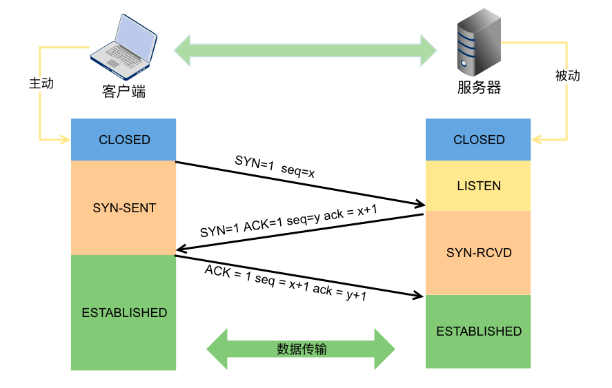
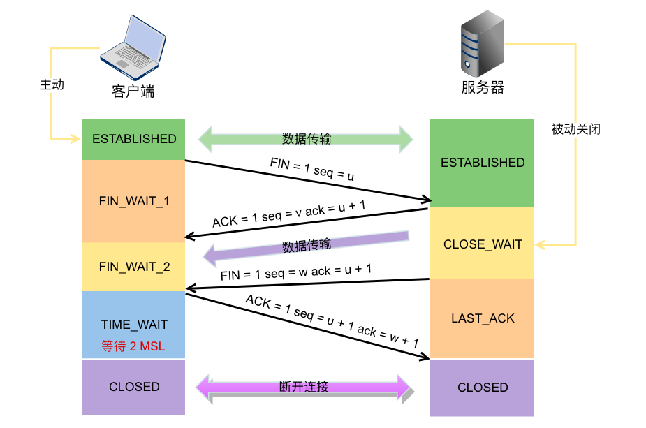

## Internet

### 浏览器点击页面的背后过程

1. 浏览器向DNS发送请求，通过DNS获取相应域名的对应IP；
2. 通过IP地址找到对应的服务器后，要求建立TCP连接（三次握手）
3. 浏览器发送HTTP Request请求，服务器收到请求后处理请求
4. 服务器返回HTTP Response响应
5. 客户端收到响应后开始解析渲染，展示页面，收到全部数据后断开TCP连接（四次挥手）

### TCP建立连接的具体过程（三次握手）

+ 客户机发送连接请求报文
  + SYN=1，Seq=x
+ 服务端收到请求报文后，如果确认建立连接则向客户机发送确认报文并且为该TCP连接分配缓存和变量
  + SYN=1，ACK=1,seq=y,ack=x+1
+ 客户端收到确认报文后，再给服务端发送确认报文，并且开始分配资源，此时传递数据
  + ACK=1，seq=x+1,ack=y+1

### 为什么不是两次握手

记客户端为A，服务端为B

如果是“两次握手”，那么在A向B发送一次请求后即可建立连接

假设A发送了一次请求，但是这个请求在传输过程中滞留；

A又发送了另一个请求，与B建立连接后正常处理完数据，断开连接后，B收到了之前滞留的请求，此时B会立即为这次“连接”分配资源，但是A并不知情。

这样会浪费大量的资源。

### TCP释放连接的具体过程（四次挥手）

+ 客户机A的进程想要断开连接（比如数据已经处理完），向服务器发送断开连接的请求
+ 服务器B可能还有没发送完的数据，先向A发送确认收到的信息，此时A不会再向B发送数据，但是仍可接收数据
+ 服务器B的数据彻底发送完后，再向A发送断开连接的请求
+ A收到后再向B发送确认的信息，等待2MSL,此时TCP连接断开

### 为什么不是“三次挥手”

+ 假如在第三步就断开连接，可能会出现一种情况，如果第三步的信号遇到延迟，A会迟迟收不到断开连接的信息，白白浪费资源
+ 假如在第四步没有等待2MSL，一旦确认信号遇到延迟或者信息有缺失，B希望A能重新发送确认，但A已经关闭连接，B会浪费很多资源

79.http 响应码 301 和 302 代表的是什么？有什么区别？

80.forward 和 redirect 的区别？

81.简述 tcp 和 udp的区别？

82.tcp 为什么要三次握手，两次不行吗？为什么？

83.说一下 tcp 粘包是怎么产生的？

84.OSI 的七层模型都有哪些？

85.get 和 post 请求有哪些区别？

86.如何实现跨域？

87.说一下 JSONP 实现原理？

## 十九、JVM

194.说一下 jvm 的主要组成部分？及其作用？

195.说一下 jvm 运行时数据区？

196.说一下堆栈的区别？

197.队列和栈是什么？有什么区别？

198.什么是双亲委派模型？

199.说一下类加载的执行过程？

200.怎么判断对象是否可以被回收？

201.java 中都有哪些引用类型？

202.说一下 jvm 有哪些垃圾回收算法？

203.说一下 jvm 有哪些垃圾回收器？

204.详细介绍一下 CMS 垃圾回收器？

205.新生代垃圾回收器和老生代垃圾回收器都有哪些？有什么区别？

206.简述分代垃圾回收器是怎么工作的？

207.说一下 jvm 调优的工具？

208.常用的 jvm 调优的参数都有哪些？

## 九、设计模式

88.说一下你熟悉的设计模式？

89.简单工厂和抽象工厂有什么区别？

## 十、Spring/Spring MVC

90.为什么要使用 spring？

91.解释一下什么是 aop？

92.解释一下什么是 ioc？

93.spring 有哪些主要模块？

94.spring 常用的注入方式有哪些？

95.spring 中的 bean 是线程安全的吗？

96.spring 支持几种 bean 的作用域？

97.spring 自动装配 bean 有哪些方式？

98.spring 事务实现方式有哪些？

99.说一下 spring 的事务隔离？

100.说一下 spring mvc 运行流程？

101.spring mvc 有哪些组件？

102.@RequestMapping 的作用是什么？

103.@Autowired 的作用是什么？

## 十一、Spring Boot/Spring Cloud

104.什么是 spring boot？

105.为什么要用 spring boot？

106.spring boot 核心配置文件是什么？

107.spring boot 配置文件有哪几种类型？它们有什么区别？

108.spring boot 有哪些方式可以实现热部署？

109.jpa 和 hibernate 有什么区别？

110.什么是 spring cloud？

111.spring cloud 断路器的作用是什么？

112.spring cloud 的核心组件有哪些？

## 十三、Mybatis

125.mybatis 中 #{}和 ${}的区别是什么？

126.mybatis 有几种分页方式？

127.RowBounds 是一次性查询全部结果吗？为什么？

128.mybatis 逻辑分页和物理分页的区别是什么？

129.mybatis 是否支持延迟加载？延迟加载的原理是什么？

130.说一下 mybatis 的一级缓存和二级缓存？

131.mybatis 和 hibernate 的区别有哪些？

132.mybatis 有哪些执行器（Executor）？

133.mybatis 分页插件的实现原理是什么？

134.mybatis 如何编写一个自定义插件？

## 十七、MySql

164.数据库的三范式是什么？

165.一张自增表里面总共有 7 条数据，删除了最后 2 条数据，重启 mysql 数据库，又插入了一条数据，此时 id 是几？

166.如何获取当前数据库版本？

167.说一下 ACID 是什么？

168.char 和 varchar 的区别是什么？

169.float 和 double 的区别是什么？

170.mysql 的内连接、左连接、右连接有什么区别？

171.mysql 索引是怎么实现的？

172.怎么验证 mysql 的索引是否满足需求？

173.说一下数据库的事务隔离？

174.说一下 mysql 常用的引擎？

175.说一下 mysql 的行锁和表锁？

176.说一下乐观锁和悲观锁？

177.mysql 问题排查都有哪些手段？

178.如何做 mysql 的性能优化？

## 十八、Redis

179.redis 是什么？都有哪些使用场景？

180.redis 有哪些功能？

181.redis 和 memecache 有什么区别？

182.redis 为什么是单线程的？

183.什么是缓存穿透？怎么解决？

184.redis 支持的数据类型有哪些？

185.redis 支持的 java 客户端都有哪些？

186.jedis 和 redisson 有哪些区别？

187.怎么保证缓存和数据库数据的一致性？

188.redis 持久化有几种方式？

189.redis 怎么实现分布式锁？

190.redis 分布式锁有什么缺陷？

191.redis 如何做内存优化？

192.redis 淘汰策略有哪些？

193.redis 常见的性能问题有哪些？该如何解决？
